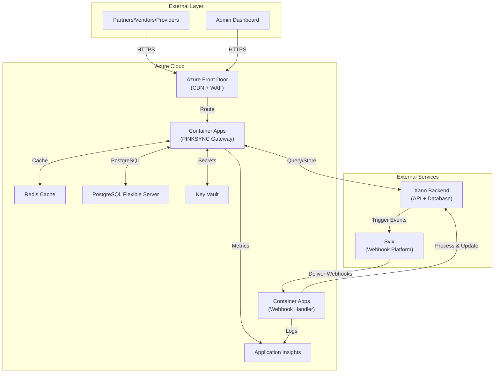
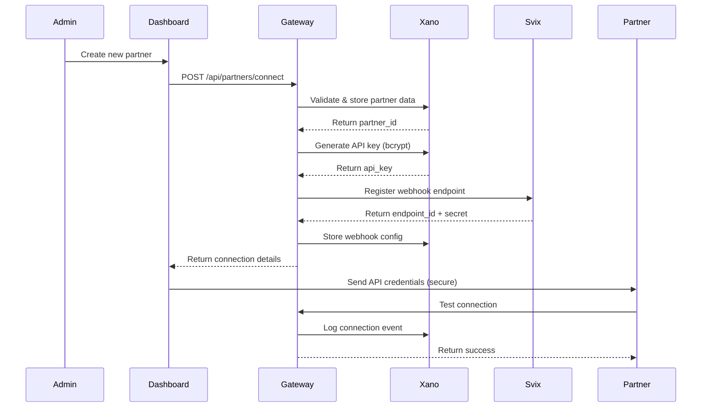
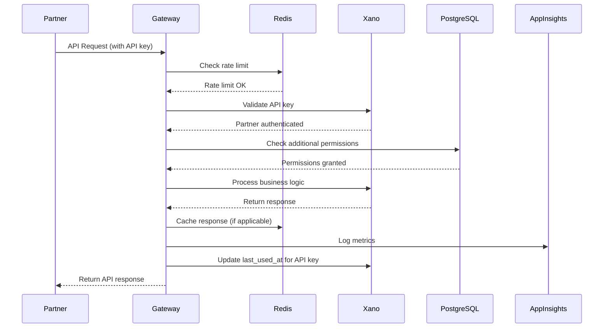
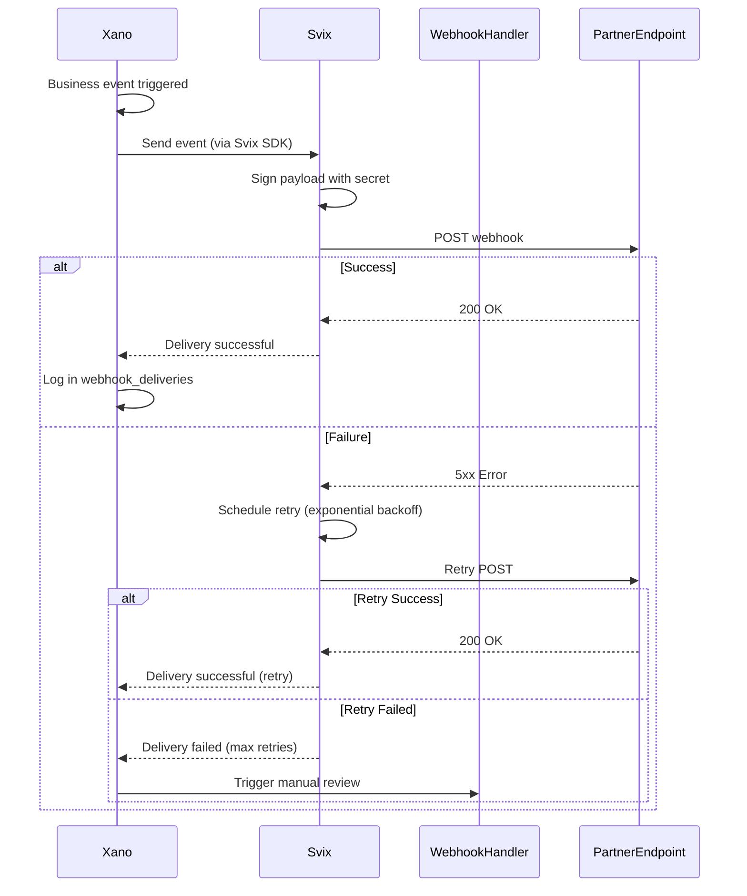

# 🏗️ PINKSYNC Architecture — Complete System Design

## 📋 Executive Summary

PINKSYNC is a production-grade integration gateway that connects partners, vendors, and providers through a unified API layer. Built on Azure Container Apps, Xano (backend/database), Svix (webhooks), and Ubuntu (webhook handlers), it provides deterministic deployment, secure authentication, and real-time event streaming.

---

## 🎯 System Architecture Overview

### Core Components

### 1. Azure Infrastructure

- **Container Apps:** Scalable microservices hosting
- **PostgreSQL Flexible Server:** Relational data storage
- **Redis Cache:** Session and response caching
- **Application Insights:** Monitoring and telemetry
- **Key Vault:** Secret management

### 2. Backend Services

- **Xano Backend:** No-code API and business logic
- **PINKSYNC Gateway:** Node.js/Express API orchestrator
- **Webhook Handler:** Event processing service
- **Svix:** Webhook delivery infrastructure

### Architecture Diagram



---

## 🗄️ Database Schema — Complete Design

### Xano Tables (Primary Backend)

- partners (Partner/Vendor/Provider Registry)
    
    ```sql
    CREATE TABLE partners (
      id SERIAL PRIMARY KEY,
      partner_id UUID UNIQUE NOT NULL DEFAULT gen_random_uuid(),
      name VARCHAR(255) NOT NULL,
      type VARCHAR(50) NOT NULL, -- 'partner', 'vendor', 'provider'
      status VARCHAR(50) DEFAULT 'pending', -- 'pending', 'active', 'suspended', 'inactive'
      api_endpoint TEXT,
      auth_method VARCHAR(50) NOT NULL, -- 'oauth2', 'api_key', 'bearer', 'basic'
      api_key_hash VARCHAR(255), -- bcrypt hash
      oauth_token_encrypted TEXT, -- encrypted OAuth tokens
      webhook_secret VARCHAR(255),
      rate_limit_per_minute INTEGER DEFAULT 100,
      metadata JSONB,
      created_at TIMESTAMP DEFAULT NOW(),
      updated_at TIMESTAMP DEFAULT NOW(),
      last_sync_at TIMESTAMP,
      created_by INTEGER REFERENCES users(id)
    );
    
    CREATE INDEX idx_partners_type ON partners(type);
    CREATE INDEX idx_partners_status ON partners(status);
    CREATE INDEX idx_partners_partner_id ON partners(partner_id);
    ```
    
- webhook_endpoints (Svix Endpoint Registry)
    
    ```sql
    CREATE TABLE webhook_endpoints (
      id SERIAL PRIMARY KEY,
      partner_id UUID REFERENCES partners(partner_id) ON DELETE CASCADE,
      svix_endpoint_id VARCHAR(255) UNIQUE NOT NULL,
      url TEXT NOT NULL,
      description TEXT,
      enabled BOOLEAN DEFAULT true,
      events TEXT[], -- Array of event types: ['order.created', 'inventory.updated']
      secret VARCHAR(255), -- Svix signing secret
      metadata JSONB,
      created_at TIMESTAMP DEFAULT NOW(),
      updated_at TIMESTAMP DEFAULT NOW()
    );
    
    CREATE INDEX idx_webhook_endpoints_partner ON webhook_endpoints(partner_id);
    CREATE INDEX idx_webhook_endpoints_svix ON webhook_endpoints(svix_endpoint_id);
    ```
    
- webhook_deliveries (Delivery Logs)
    
    ```sql
    CREATE TABLE webhook_deliveries (
      id SERIAL PRIMARY KEY,
      partner_id UUID REFERENCES partners(partner_id),
      endpoint_id INTEGER REFERENCES webhook_endpoints(id),
      event_type VARCHAR(100) NOT NULL,
      payload JSONB NOT NULL,
      status VARCHAR(50) NOT NULL, -- 'pending', 'delivered', 'failed', 'retrying'
      response_code INTEGER,
      response_body TEXT,
      attempt_count INTEGER DEFAULT 0,
      max_attempts INTEGER DEFAULT 3,
      next_retry_at TIMESTAMP,
      delivered_at TIMESTAMP,
      created_at TIMESTAMP DEFAULT NOW()
    );
    
    CREATE INDEX idx_webhook_deliveries_partner ON webhook_deliveries(partner_id);
    CREATE INDEX idx_webhook_deliveries_status ON webhook_deliveries(status);
    CREATE INDEX idx_webhook_deliveries_created ON webhook_deliveries(created_at DESC);
    ```
    
- integration_logs (Audit Trail)
    
    ```sql
    CREATE TABLE integration_logs (
      id SERIAL PRIMARY KEY,
      partner_id UUID REFERENCES partners(partner_id),
      event_type VARCHAR(100) NOT NULL, -- 'connection.created', 'api.request', 'webhook.sent'
      severity VARCHAR(20) DEFAULT 'info', -- 'debug', 'info', 'warning', 'error', 'critical'
      message TEXT,
      request_id VARCHAR(255),
      metadata JSONB,
      ip_address INET,
      user_agent TEXT,
      created_at TIMESTAMP DEFAULT NOW()
    );
    
    CREATE INDEX idx_integration_logs_partner ON integration_logs(partner_id);
    CREATE INDEX idx_integration_logs_created ON integration_logs(created_at DESC);
    CREATE INDEX idx_integration_logs_severity ON integration_logs(severity);
    ```
    
- api_keys (API Key Management)
    
    ```sql
    CREATE TABLE api_keys (
      id SERIAL PRIMARY KEY,
      key_id VARCHAR(50) UNIQUE NOT NULL, -- e.g., 'pk_live_...'
      key_hash VARCHAR(255) NOT NULL, -- bcrypt hash
      partner_id UUID REFERENCES partners(partner_id) ON DELETE CASCADE,
      name VARCHAR(255),
      scopes TEXT[], -- ['read:orders', 'write:inventory']
      expires_at TIMESTAMP,
      last_used_at TIMESTAMP,
      is_active BOOLEAN DEFAULT true,
      created_at TIMESTAMP DEFAULT NOW(),
      created_by INTEGER REFERENCES users(id)
    );
    
    CREATE INDEX idx_api_keys_partner ON api_keys(partner_id);
    CREATE INDEX idx_api_keys_key_id ON api_keys(key_id);
    ```
    
- sync_jobs (Background Sync Tasks)
    
    ```sql
    CREATE TABLE sync_jobs (
      id SERIAL PRIMARY KEY,
      partner_id UUID REFERENCES partners(partner_id),
      job_type VARCHAR(100) NOT NULL, -- 'full_sync', 'incremental_sync', 'webhook_retry'
      status VARCHAR(50) DEFAULT 'pending', -- 'pending', 'running', 'completed', 'failed'
      progress_percent DECIMAL(5,2) DEFAULT 0,
      records_processed INTEGER DEFAULT 0,
      records_total INTEGER,
      error_message TEXT,
      started_at TIMESTAMP,
      completed_at TIMESTAMP,
      created_at TIMESTAMP DEFAULT NOW()
    );
    
    CREATE INDEX idx_sync_jobs_partner ON sync_jobs(partner_id);
    CREATE INDEX idx_sync_jobs_status ON sync_jobs(status);
    ```
    

### PostgreSQL Tables (Azure Flexible Server)

- sessions (User Sessions - Redis alternative)
    
    ```sql
    CREATE TABLE sessions (
      sid VARCHAR(255) PRIMARY KEY,
      sess JSONB NOT NULL,
      expire TIMESTAMP NOT NULL
    );
    
    CREATE INDEX idx_sessions_expire ON sessions(expire);
    ```
    
- rate_limits (Rate Limiting Tracker)
    
    ```sql
    CREATE TABLE rate_limits (
      id SERIAL PRIMARY KEY,
      identifier VARCHAR(255) NOT NULL, -- partner_id or IP address
      endpoint VARCHAR(255) NOT NULL,
      request_count INTEGER DEFAULT 0,
      window_start TIMESTAMP NOT NULL,
      window_end TIMESTAMP NOT NULL,
      created_at TIMESTAMP DEFAULT NOW()
    );
    
    CREATE UNIQUE INDEX idx_rate_limits_unique ON rate_limits(identifier, endpoint, window_start);
    CREATE INDEX idx_rate_limits_window ON rate_limits(window_end);
    ```
    

---

## 🔄 Integration Flow — Step-by-Step

### 1. Partner Onboarding Flow



### 2. API Request Flow



### 3. Webhook Delivery Flow



---

## 🔐 Security Architecture

### Authentication Methods

- API Key Authentication (Recommended for Vendors)
    
    ```jsx
    // Gateway: Validate API key
    const bcrypt = require('bcrypt');
    
    async function validateApiKey(keyId, providedKey) {
      const apiKeyRecord = await xano.getApiKey(keyId);
      
      if (!apiKeyRecord || !apiKeyRecord.is_active) {
        throw new Error('Invalid or inactive API key');
      }
      
      if (apiKeyRecord.expires_at && new Date(apiKeyRecord.expires_at) < new Date()) {
        throw new Error('API key expired');
      }
      
      const isValid = await bcrypt.compare(providedKey, apiKeyRecord.key_hash);
      
      if (!isValid) {
        throw new Error('API key verification failed');
      }
      
      // Update last_used_at
      await xano.updateApiKey(keyId, { last_used_at: new Date() });
      
      return apiKeyRecord;
    }
    ```
    
- OAuth 2.0 Flow (For Partners)
    
    ```jsx
    // Gateway: OAuth2 implementation
    const { AuthorizationCode } = require('simple-oauth2');
    
    const oauth2Client = new AuthorizationCode({
      client: {
        id: process.env.OAUTH_CLIENT_ID,
        secret: process.env.OAUTH_CLIENT_SECRET,
      },
      auth: {
        tokenHost: 'https://partner-auth.example.com',
        tokenPath: '/oauth/token',
        authorizePath: '/oauth/authorize',
      },
    });
    
    // Step 1: Redirect partner to authorization URL
    app.get('/oauth/authorize/:partnerId', (req, res) => {
      const authorizationUri = oauth2Client.authorizeURL({
        redirect_uri: `https://gateway.pinksync.vr4deaf.org/oauth/callback`,
        scope: 'read:orders write:inventory',
        state: req.params.partnerId, // CSRF protection
      });
      
      res.redirect(authorizationUri);
    });
    
    // Step 2: Handle callback and exchange code for token
    app.get('/oauth/callback', async (req, res) => {
      const { code, state: partnerId } = req.query;
      
      try {
        const tokenParams = {
          code,
          redirect_uri: 'https://gateway.pinksync.vr4deaf.org/oauth/callback',
        };
        
        const accessToken = await oauth2Client.getToken(tokenParams);
        
        // Encrypt and store token in Xano
        const encryptedToken = encrypt(accessToken.token.access_token);
        await xano.updatePartner(partnerId, {
          oauth_token_encrypted: encryptedToken,
          status: 'active',
        });
        
        res.send('✅ Authorization successful!');
      } catch (error) {
        res.status(500).send('❌ Authorization failed: ' + error.message);
      }
    });
    ```
    
- Webhook Signature Verification (Svix)
    
    ```jsx
    // Webhook Handler: Verify Svix signatures
    const { Webhook } = require('svix');
    
    app.post('/webhooks/partner/:partnerId', async (req, res) => {
      const payload = req.body.toString();
      const headers = {
        'svix-id': req.headers['svix-id'],
        'svix-timestamp': req.headers['svix-timestamp'],
        'svix-signature': req.headers['svix-signature'],
      };
      
      const wh = new Webhook(process.env.SVIX_WEBHOOK_SECRET);
      
      let event;
      try {
        event = wh.verify(payload, headers);
      } catch (err) {
        console.error('❌ Invalid webhook signature:', err.message);
        return res.status(400).json({ error: 'Invalid signature' });
      }
      
      // Process verified event
      await processWebhookEvent(req.params.partnerId, event);
      
      res.status(200).json({ received: true });
    });
    ```
    

### Secret Management with Azure Key Vault

```jsx
// Gateway: Retrieve secrets from Key Vault
const { SecretClient } = require('@azure/keyvault-secrets');
const { DefaultAzureCredential } = require('@azure/identity');

const credential = new DefaultAzureCredential();
const vaultUrl = `https://${process.env.KEY_VAULT_NAME}.vault.azure.net`;
const client = new SecretClient(vaultUrl, credential);

async function getSecret(secretName) {
  try {
    const secret = await client.getSecret(secretName);
    return secret.value;
  } catch (error) {
    console.error(`Failed to retrieve secret ${secretName}:`, error.message);
    throw error;
  }
}

// Usage
const xanoApiKey = await getSecret('xano-api-key');
const svixApiKey = await getSecret('svix-api-key');

```

### Rate Limiting Implementation

```jsx
// Gateway: Rate limiting middleware
const redis = require('redis');
const redisClient = redis.createClient({
  host: process.env.REDIS_HOST,
  port: process.env.REDIS_PORT,
});

async function rateLimitMiddleware(req, res, next) {
  const partnerId = req.partnerId; // From authenticated request
  const endpoint = req.path;
  const key = `ratelimit:${partnerId}:${endpoint}`;
  
  const limit = 100; // requests per minute
  const windowSeconds = 60;
  
  const current = await redisClient.incr(key);
  
  if (current === 1) {
    await redisClient.expire(key, windowSeconds);
  }
  
  if (current > limit) {
    const ttl = await redisClient.ttl(key);
    res.set('X-RateLimit-Limit', limit);
    res.set('X-RateLimit-Remaining', 0);
    res.set('X-RateLimit-Reset', Date.now() + ttl * 1000);
    return res.status(429).json({ error: 'Rate limit exceeded' });
  }
  
  res.set('X-RateLimit-Limit', limit);
  res.set('X-RateLimit-Remaining', limit - current);
  
  next();
}

```

---

## 🚀 Deployment Architecture

### Azure Resources — Infrastructure as Code

```powershell
# deploy-infrastructure.ps1
# Complete Azure infrastructure deployment

param(
    [Parameter(Mandatory=$true)]
    [string]$Environment = "prod"
)

$ErrorActionPreference = "Stop"

# Configuration
$RESOURCE_GROUP = "pinksync-$Environment-rg"
$LOCATION = "eastus"
$CONTAINER_REGISTRY = "pinksyncacr$Environment"
$POSTGRES_SERVER = "pinksync-$Environment-pg"
$REDIS_NAME = "pinksync-$Environment-redis"
$KEY_VAULT = "pinksync-$Environment-kv"
$APP_INSIGHTS = "pinksync-$Environment-ai"
$CONTAINER_APP_ENV = "pinksync-$Environment-env"
$GATEWAY_APP = "pinksync-gateway"
$WEBHOOK_APP = "pinksync-webhooks"

Write-Host "🚀 Deploying PINKSYNC Infrastructure ($Environment)" -ForegroundColor Cyan

# Login
Write-Host "Authenticating..." -ForegroundColor Yellow
az login

# Create Resource Group
Write-Host "Creating resource group..." -ForegroundColor Yellow
az group create --name $RESOURCE_GROUP --location $LOCATION

# Create Container Registry
Write-Host "Creating container registry..." -ForegroundColor Yellow
az acr create `
  --resource-group $RESOURCE_GROUP `
  --name $CONTAINER_REGISTRY `
  --sku Standard `
  --admin-enabled true

# Create PostgreSQL Flexible Server
Write-Host "Creating PostgreSQL server..." -ForegroundColor Yellow
az postgres flexible-server create `
  --resource-group $RESOURCE_GROUP `
  --name $POSTGRES_SERVER `
  --location $LOCATION `
  --admin-user pgadmin `
  --admin-password "$(New-Guid)" `
  --sku-name Standard_B2s `
  --tier Burstable `
  --version 14 `
  --storage-size 32 `
  --public-access 0.0.0.0-255.255.255.255

# Create database
az postgres flexible-server db create `
  --resource-group $RESOURCE_GROUP `
  --server-name $POSTGRES_SERVER `
  --database-name pinksync

# Create Redis Cache
Write-Host "Creating Redis cache..." -ForegroundColor Yellow
az redis create `
  --resource-group $RESOURCE_GROUP `
  --name $REDIS_NAME `
  --location $LOCATION `
  --sku Basic `
  --vm-size c0

# Create Key Vault
Write-Host "Creating Key Vault..." -ForegroundColor Yellow
az keyvault create `
  --resource-group $RESOURCE_GROUP `
  --name $KEY_VAULT `
  --location $LOCATION `
  --enable-rbac-authorization false

# Store secrets
Write-Host "Storing secrets in Key Vault..." -ForegroundColor Yellow
az keyvault secret set --vault-name $KEY_VAULT --name "xano-api-key" --value "YOUR_XANO_KEY"
az keyvault secret set --vault-name $KEY_VAULT --name "svix-api-key" --value "YOUR_SVIX_KEY"
az keyvault secret set --vault-name $KEY_VAULT --name "postgres-connection-string" --value "postgres://..."

# Create Application Insights
Write-Host "Creating Application Insights..." -ForegroundColor Yellow
az monitor app-insights component create `
  --app $APP_INSIGHTS `
  --location $LOCATION `
  --resource-group $RESOURCE_GROUP `
  --application-type web

# Create Container Apps Environment
Write-Host "Creating Container Apps environment..." -ForegroundColor Yellow
az containerapp env create `
  --name $CONTAINER_APP_ENV `
  --resource-group $RESOURCE_GROUP `
  --location $LOCATION

# Deploy Gateway App
Write-Host "Deploying Gateway container app..." -ForegroundColor Yellow
az containerapp create `
  --name $GATEWAY_APP `
  --resource-group $RESOURCE_GROUP `
  --environment $CONTAINER_APP_ENV `
  --image "$CONTAINER_REGISTRY.azurecr.io/pinksync-gateway:latest" `
  --target-port 3000 `
  --ingress external `
  --min-replicas 1 `
  --max-replicas 10 `
  --registry-server "$CONTAINER_REGISTRY.azurecr.io" `
  --env-vars `
    "NODE_ENV=production" `
    "XANO_API_URL=https://your-workspace.xano.io/api:v1" `
    "REDIS_HOST=$REDIS_NAME.redis.cache.windows.net"

# Deploy Webhook Handler App
Write-Host "Deploying Webhook Handler container app..." -ForegroundColor Yellow
az containerapp create `
  --name $WEBHOOK_APP `
  --resource-group $RESOURCE_GROUP `
  --environment $CONTAINER_APP_ENV `
  --image "$CONTAINER_REGISTRY.azurecr.io/pinksync-webhooks:latest" `
  --target-port 3001 `
  --ingress external `
  --min-replicas 1 `
  --max-replicas 5 `
  --registry-server "$CONTAINER_REGISTRY.azurecr.io"

Write-Host "✅ Infrastructure deployment complete!" -ForegroundColor Green
Write-Host "Gateway URL: https://$GATEWAY_APP.azurecontainerapps.io" -ForegroundColor Cyan
Write-Host "Webhook Handler URL: https://$WEBHOOK_APP.azurecontainerapps.io" -ForegroundColor Cyan

```

### Docker Compose — Local Development

```yaml
# docker-compose.yml
version: '3.8'

services:
  gateway:
    build:
      context: ./gateway
      dockerfile: Dockerfile
    ports:
      - "3000:3000"
    environment:
      - NODE_ENV=development
      - XANO_API_URL=${XANO_API_URL}
      - XANO_API_KEY=${XANO_API_KEY}
      - REDIS_HOST=redis
      - REDIS_PORT=6379
      - POSTGRES_HOST=postgres
      - POSTGRES_DB=pinksync
      - POSTGRES_USER=postgres
      - POSTGRES_PASSWORD=postgres
      - SVIX_API_KEY=${SVIX_API_KEY}
    depends_on:
      - redis
      - postgres
    volumes:
      - ./gateway:/app
      - /app/node_modules
    command: npm run dev

  webhook-handler:
    build:
      context: ./webhook-handler
      dockerfile: Dockerfile
    ports:
      - "3001:3001"
    environment:
      - NODE_ENV=development
      - XANO_API_URL=${XANO_API_URL}
      - XANO_API_KEY=${XANO_API_KEY}
      - SVIX_WEBHOOK_SECRET=${SVIX_WEBHOOK_SECRET}
    volumes:
      - ./webhook-handler:/app
      - /app/node_modules
    command: npm run dev

  redis:
    image: redis:7-alpine
    ports:
      - "6379:6379"
    volumes:
      - redis-data:/data

  postgres:
    image: postgres:14-alpine
    ports:
      - "5432:5432"
    environment:
      - POSTGRES_DB=pinksync
      - POSTGRES_USER=postgres
      - POSTGRES_PASSWORD=postgres
    volumes:
      - postgres-data:/var/lib/postgresql/data

  pgadmin:
    image: dpage/pgadmin4
    ports:
      - "5050:80"
    environment:
      - PGADMIN_DEFAULT_EMAIL=admin@pinksync.com
      - PGADMIN_DEFAULT_PASSWORD=admin

volumes:
  redis-data:
  postgres-data:

```

### CI/CD Pipeline (GitHub Actions)

```yaml
# .github/workflows/deploy.yml
name: Deploy PINKSYNC

on:
  push:
    branches: [main]
  workflow_dispatch:

env:
  AZURE_CONTAINER_REGISTRY: pinksyncacrprod
  RESOURCE_GROUP: pinksync-prod-rg

jobs:
  build-and-deploy:
    runs-on: ubuntu-latest
    
    steps:
      - name: Checkout code
        uses: actions/checkout@v3
      
      - name: Azure Login
        uses: azure/login@v1
        with:
          creds: ${{ secrets.AZURE_CREDENTIALS }}
      
      - name: Build and push Gateway image
        run: |
          az acr build \
            --registry ${{ env.AZURE_CONTAINER_REGISTRY }} \
            --image pinksync-gateway:${{ github.sha }} \
            --image pinksync-gateway:latest \
            --file gateway/Dockerfile \
            gateway/
      
      - name: Build and push Webhook Handler image
        run: |
          az acr build \
            --registry ${{ env.AZURE_CONTAINER_REGISTRY }} \
            --image pinksync-webhooks:${{ github.sha }} \
            --image pinksync-webhooks:latest \
            --file webhook-handler/Dockerfile \
            webhook-handler/
      
      - name: Deploy Gateway to Container Apps
        run: |
          az containerapp update \
            --name pinksync-gateway \
            --resource-group ${{ env.RESOURCE_GROUP }} \
            --image ${{ env.AZURE_CONTAINER_REGISTRY }}.azurecr.io/pinksync-gateway:${{ github.sha }}
      
      - name: Deploy Webhook Handler to Container Apps
        run: |
          az containerapp update \
            --name pinksync-webhooks \
            --resource-group ${{ env.RESOURCE_GROUP }} \
            --image ${{ env.AZURE_CONTAINER_REGISTRY }}.azurecr.io/pinksync-webhooks:${{ github.sha }}
      
      - name: Run database migrations
        run: |
          # Implement migration logic
          echo "Running migrations..."

```

---

## 📊 Monitoring & Observability

### Application Insights Integration

```jsx
// gateway/monitoring.js
const appInsights = require('applicationinsights');

appInsights.setup(process.env.APPLICATIONINSIGHTS_CONNECTION_STRING)
  .setAutoDependencyCorrelation(true)
  .setAutoCollectRequests(true)
  .setAutoCollectPerformance(true)
  .setAutoCollectExceptions(true)
  .setAutoCollectDependencies(true)
  .setAutoCollectConsole(true)
  .setUseDiskRetryCaching(true)
  .start();

const client = appInsights.defaultClient;

// Track custom events
function trackPartnerConnection(partnerId, status) {
  client.trackEvent({
    name: 'PartnerConnection',
    properties: {
      partnerId,
      status,
      timestamp: new Date().toISOString(),
    },
  });
}

// Track API requests
function trackApiRequest(partnerId, endpoint, duration, statusCode) {
  client.trackMetric({
    name: 'ApiRequestDuration',
    value: duration,
    properties: {
      partnerId,
      endpoint,
      statusCode,
    },
  });
}

// Track webhook deliveries
function trackWebhookDelivery(partnerId, eventType, success) {
  client.trackEvent({
    name: 'WebhookDelivery',
    properties: {
      partnerId,
      eventType,
      success,
      timestamp: new Date().toISOString(),
    },
  });
}

module.exports = {
  trackPartnerConnection,
  trackApiRequest,
  trackWebhookDelivery,
};

```

### Grafana Dashboard (Metrics)

```jsx
// Example: Custom metrics endpoint for Grafana
app.get('/metrics', async (req, res) => {
  const metrics = {
    active_partners: await xano.query('SELECT COUNT(*) FROM partners WHERE status = ?', ['active']),
    total_api_requests_today: await redis.get('api_requests:today') || 0,
    webhook_success_rate: await calculateWebhookSuccessRate(),
    avg_response_time_ms: await calculateAvgResponseTime(),
  };
  
  res.json(metrics);
});

```

### Alerting Rules

- **High Error Rate:** Alert when API error rate exceeds 5% over 5 minutes
- **Webhook Failures:** Alert when webhook delivery success rate drops below 90%
- **Rate Limit Exceeded:** Notify when a partner hits rate limits 10+ times in 1 hour
- **Database Connection Issues:** Alert on PostgreSQL connection failures
- **Redis Cache Miss Rate:** Alert when cache miss rate exceeds 50%

---

## 🧪 Testing Strategy

### Unit Tests (Jest)

```jsx
// gateway/__tests__/auth.test.js
const { validateApiKey } = require('../auth');

describe('API Key Validation', () => {
  test('should validate correct API key', async () => {
    const result = await validateApiKey('pk_test_123', 'correct_key');
    expect(result).toBeTruthy();
  });
  
  test('should reject invalid API key', async () => {
    await expect(validateApiKey('pk_test_123', 'wrong_key'))
      .rejects.toThrow('API key verification failed');
  });
  
  test('should reject expired API key', async () => {
    await expect(validateApiKey('pk_test_expired', 'key'))
      .rejects.toThrow('API key expired');
  });
});

```

### Integration Tests

```jsx
// gateway/__tests__/integration/partner-flow.test.js
const request = require('supertest');
const app = require('../../app');

describe('Partner Onboarding Flow', () => {
  test('should complete full onboarding process', async () => {
    // Step 1: Create partner
    const createResponse = await request(app)
      .post('/api/partners/connect')
      .send({
        name: 'Test Partner',
        type: 'vendor',
        api_endpoint: 'https://api.testpartner.com',
        auth_method: 'api_key',
      });
    
    expect(createResponse.status).toBe(201);
    expect(createResponse.body).toHaveProperty('partner_id');
    expect(createResponse.body).toHaveProperty('api_key');
    
    const { partner_id, api_key } = createResponse.body;
    
    // Step 2: Test API call with new key
    const apiResponse = await request(app)
      .get('/api/test')
      .set('Authorization', `Bearer ${api_key}`);
    
    expect(apiResponse.status).toBe(200);
    
    // Step 3: Verify webhook endpoint registered
    const webhooksResponse = await request(app)
      .get(`/api/partners/${partner_id}/webhooks`)
      .set('Authorization', `Bearer ${api_key}`);
    
    expect(webhooksResponse.status).toBe(200);
    expect(webhooksResponse.body.webhooks).toBeInstanceOf(Array);
  });
});

```

### Load Testing (k6)

```jsx
// loadtest.js
import http from 'k6/http';
import { check, sleep } from 'k6';

export const options = {
  stages: [
    { duration: '2m', target: 100 }, // Ramp up to 100 users
    { duration: '5m', target: 100 }, // Stay at 100 users
    { duration: '2m', target: 200 }, // Ramp up to 200 users
    { duration: '5m', target: 200 }, // Stay at 200 users
    { duration: '2m', target: 0 },   // Ramp down to 0 users
  ],
  thresholds: {
    http_req_duration: ['p(95)<500'], // 95% of requests under 500ms
    http_req_failed: ['rate<0.05'],   // Error rate under 5%
  },
};

export default function () {
  const url = 'https://gateway.pinksync.vr4deaf.org/api/test';
  const params = {
    headers: {
      'Authorization': 'Bearer pk_test_123456',
    },
  };
  
  const res = http.get(url, params);
  
  check(res, {
    'status is 200': (r) => r.status === 200,
    'response time < 500ms': (r) => r.timings.duration < 500,
  });
  
  sleep(1);
}

```

---

## 📚 API Documentation

### REST API Endpoints

- POST /api/partners/connect — Create New Partner
    
    ```jsx
    {
      "name": "Acme Corp",
      "type": "vendor",
      "api_endpoint": "https://api.acmecorp.com/v1",
      "auth_method": "api_key",
      "credentials": {
        "api_key": "acme_key_123456"
      },
      "webhook_events": ["order.created", "inventory.updated"]
    }
    ```
    
    **Response:**
    
    ```jsx
    {
      "partner_id": "550e8400-e29b-41d4-a716-446655440000",
      "api_key": "pk_live_abcdef123456",
      "webhook_secret": "whsec_xyz789",
      "status": "active",
      "created_at": "2026-02-26T18:23:00Z"
    }
    ```
    
- GET /api/partners/:partnerId — Get Partner Details
    
    **Headers:** `Authorization: Bearer pk_live_...`
    
    **Response:**
    
    ```jsx
    {
      "partner_id": "550e8400-e29b-41d4-a716-446655440000",
      "name": "Acme Corp",
      "type": "vendor",
      "status": "active",
      "api_endpoint": "https://api.acmecorp.com/v1",
      "rate_limit_per_minute": 100,
      "last_sync_at": "2026-02-26T17:30:00Z",
      "created_at": "2026-02-20T10:00:00Z"
    }
    ```
    
- POST /api/webhooks/register — Register Webhook Endpoint
    
    ```jsx
    {
      "url": "https://api.acmecorp.com/webhooks/pinksync",
      "events": ["order.created", "inventory.updated"],
      "description": "Production webhook endpoint"
    }
    ```
    
    **Response:**
    
    ```jsx
    {
      "endpoint_id": "ep_1234567890",
      "url": "https://api.acmecorp.com/webhooks/pinksync",
      "secret": "whsec_abc123xyz",
      "events": ["order.created", "inventory.updated"],
      "enabled": true
    }
    ```
    
- GET /api/webhooks/deliveries — Get Webhook Delivery Logs
    
    **Query Params:** `?status=failed&limit=50&offset=0`
    
    **Response:**
    
    ```jsx
    {
      "deliveries": [
        {
          "id": 12345,
          "event_type": "order.created",
          "status": "failed",
          "response_code": 500,
          "attempt_count": 3,
          "next_retry_at": "2026-02-26T18:30:00Z",
          "created_at": "2026-02-26T18:00:00Z"
        }
      ],
      "total": 127,
      "limit": 50,
      "offset": 0
    }
    ```
    

---

## 🔧 Troubleshooting Guide

### Common Issues & Solutions

- Issue: Webhook deliveries failing with 401 Unauthorized
    
    **Cause:** Webhook signature verification failing on partner's end
    
    **Solution:**
    
    - Verify partner is using correct `webhook_secret`
    - Check Svix signature headers are being forwarded correctly
    - Validate partner's endpoint is implementing Svix verification correctly
    - Check webhook delivery logs in Svix dashboard
- Issue: High API response times (>1s)
    
    **Cause:** Database queries not optimized or Redis cache misses
    
    **Solution:**
    
    - Check PostgreSQL slow query log: `SELECT * FROM pg_stat_statements ORDER BY mean_exec_time DESC;`
    - Verify Redis is properly configured and connected
    - Add database indexes on frequently queried columns
    - Implement query result caching in Redis
    - Scale up Container Apps if CPU/memory is maxed out
- Issue: Container Apps not starting after deployment
    
    **Cause:** Environment variables missing or incorrect
    
    **Solution:**
    
    - Check Container App logs: `az containerapp logs show --name pinksync-gateway --resource-group pinksync-prod-rg`
    - Verify all required environment variables are set in Container App configuration
    - Check Key Vault secrets are accessible (RBAC permissions)
    - Validate Docker image builds successfully locally: `docker build -t test .`
- Issue: Rate limiting not working correctly
    
    **Cause:** Redis connection issues or stale keys
    
    **Solution:**
    
    - Test Redis connection: `redis-cli -h [redis-host] PING`
    - Check Redis memory usage: `INFO memory`
    - Clear rate limit keys if needed: `redis-cli --scan --pattern "ratelimit:*" | xargs redis-cli DEL`
    - Verify rate limit middleware is correctly applied to routes
