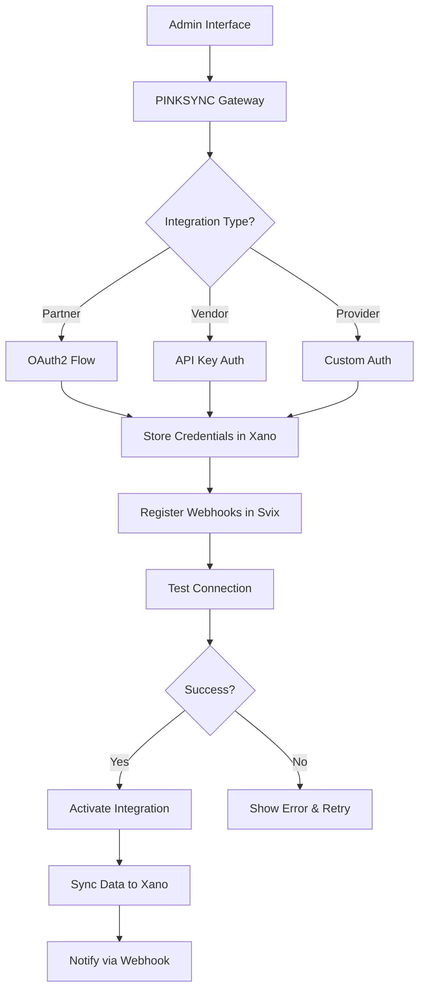
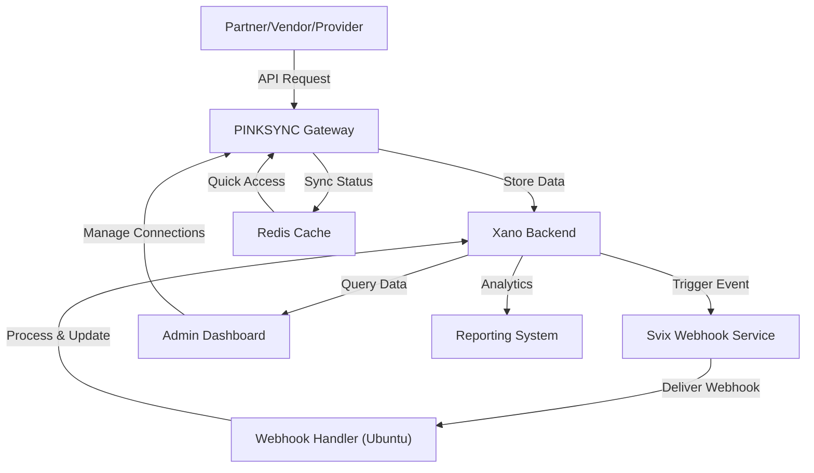

## Linux Ubuntu + Svix + Xano + PINKSYNC Gateway Architecture

### System Overview

Autonomous project management system using Ubuntu as OS base, Svix for webhook orchestration, Xano as no-code backend, and PINKSYNC as integration gateway.

### Architecture Components

### OS Foundation

- **Ubuntu Server 22.04 LTS** - Base operating system
- **Docker** - Container runtime for services
- **Nginx** - Reverse proxy and load balancer
- **Systemd** - Service management

### Integration Layer

- **Svix** - Webhook delivery platform
- **Xano** - No-code backend and API builder
- **PINKSYNC Gateway** - Partner/vendor integration hub
- **Redis** - Message queue and caching

### Webhook Orchestration with Svix

Svix handles reliable webhook delivery for all system events:

```jsx
// Svix webhook setup for PINKSYNC events
const { Svix } = require('svix');

const svix = new Svix(process.env.SVIX_API_KEY);

// Create application for PINKSYNC
async function setupPINKSYNCWebhooks() {
  const app = await svix.application.create({
    name: "PINKSYNC Gateway",
    uid: "pinksync-prod"
  });

  // Define event types
  const eventTypes = [
    'partner.connected',
    'vendor.added',
    'provider.registered',
    'sync.completed',
    'api.request',
    'workflow.triggered'
  ];

  for (const eventType of eventTypes) {
    await svix.eventType.create(app.id, {
      name: eventType,
      description: `PINKSYNC ${eventType} event`
    });
  }

  return app;
}

// Send webhook when partner connects
async function notifyPartnerConnected(partnerId, partnerData) {
  await svix.message.create('pinksync-prod', {
    eventType: 'partner.connected',
    payload: {
      partnerId,
      name: partnerData.name,
      apiEndpoint: partnerData.endpoint,
      connectedAt: new Date().toISOString()
    }
  });
}

```

### Xano Backend Configuration

Xano serves as the primary backend for project management, API orchestration, and data flow:

- **Database Tables** - Projects, Tasks, Partners, Vendors, Providers, API Keys, Webhooks
- **API Endpoints** - RESTful APIs for all CRUD operations
- **Business Logic** - No-code functions for workflow automation
- **Authentication** - JWT-based API authentication
- **Integrations** - Zapier, [Make.com](http://Make.com), custom webhooks

### Xano API Structure

```
GET    /api/projects              - List all projects
POST   /api/projects              - Create new project
GET    /api/projects/{id}         - Get project details
PATCH  /api/projects/{id}         - Update project
DELETE /api/projects/{id}         - Delete project

GET    /api/partners              - List connected partners
POST   /api/partners/connect      - Connect new partner
POST   /api/partners/{id}/sync    - Trigger sync with partner

GET    /api/vendors               - List vendors
POST   /api/vendors/add           - Add new vendor
GET    /api/vendors/{id}/status   - Check vendor integration status

POST   /api/webhooks/register     - Register webhook endpoint
POST   /api/webhooks/test         - Test webhook delivery
GET    /api/webhooks/logs         - View webhook delivery logs

```

### PINKSYNC Gateway Configuration

PINKSYNC acts as the central integration hub for connecting partners, vendors, and service providers:

```yaml
# pinksync-gateway.yml
# Configuration for PINKSYNC integration gateway

gateway:
  name: PINKSYNC Gateway
  version: 1.0.0
  base_url: https://gateway.pinksync.vr4deaf.org
  
integrations:
  partners:
    - name: "Partner A"
      type: "oauth2"
      endpoint: "https://partner-a.com/api/v1"
      auth:
        client_id: "${PARTNER_A_CLIENT_ID}"
        client_secret: "${PARTNER_A_CLIENT_SECRET}"
      webhooks:
        - event: "order.created"
          target: "https://xano.io/api/webhooks/partner-a/order"
        
  vendors:
    - name: "Vendor B"
      type: "api_key"
      endpoint: "https://vendor-b.com/api"
      auth:
        api_key: "${VENDOR_B_API_KEY}"
      sync_interval: "15m"
      
  providers:
    - name: "Service Provider C"
      type: "custom"
      endpoint: "https://provider-c.com/integration"
      auth:
        method: "bearer_token"
        token: "${PROVIDER_C_TOKEN}"

webhook_delivery:
  provider: "svix"
  retry_strategy:
    max_attempts: 3
    backoff: "exponential"
    
message_queue:
  type: "redis"
  host: "localhost"
  port: 6379
  db: 0

```

### Ubuntu Server Setup Script

```bash
#!/bin/bash
# setup-ubuntu-pinksync.sh
# Ubuntu server setup for PINKSYNC Gateway + Xano + Svix

set -e

echo "🐧 Setting up Ubuntu server for PINKSYNC..."

# Update system
sudo apt update && sudo apt upgrade -y

# Install Docker
echo "🐳 Installing Docker..."
curl -fsSL https://get.docker.com -o get-docker.sh
sh get-docker.sh
sudo usermod -aG docker $USER

# Install Docker Compose
sudo apt install docker-compose -y

# Install Nginx
echo "🌐 Installing Nginx..."
sudo apt install nginx -y

# Install Redis
echo "📦 Installing Redis..."
sudo apt install redis-server -y
sudo systemctl enable redis-server

# Install Node.js (for webhook handlers)
echo "📗 Installing Node.js..."
curl -fsSL https://deb.nodesource.com/setup_18.x | sudo -E bash -
sudo apt install -y nodejs

# Create PINKSYNC directory
mkdir -p ~/pinksync-gateway
cd ~/pinksync-gateway

# Create docker-compose.yml
cat > docker-compose.yml << 'EOF'
version: '3.8'

services:
  pinksync-gateway:
    image: pinksync/gateway:latest
    ports:
      - "3000:3000"
    environment:
      - XANO_API_URL=${XANO_API_URL}
      - XANO_API_KEY=${XANO_API_KEY}
      - SVIX_API_KEY=${SVIX_API_KEY}
      - REDIS_URL=redis://redis:6379
    depends_on:
      - redis
    restart: unless-stopped

  redis:
    image: redis:7-alpine
    ports:
      - "6379:6379"
    volumes:
      - redis-data:/data
    restart: unless-stopped

  webhook-handler:
    image: pinksync/webhook-handler:latest
    ports:
      - "3001:3001"
    environment:
      - SVIX_WEBHOOK_SECRET=${SVIX_WEBHOOK_SECRET}
      - XANO_API_URL=${XANO_API_URL}
    restart: unless-stopped

volumes:
  redis-data:
EOF

# Create .env file
cat > .env << 'EOF'
XANO_API_URL=https://your-workspace.xano.io/api:v1
XANO_API_KEY=your-xano-api-key
SVIX_API_KEY=your-svix-api-key
SVIX_WEBHOOK_SECRET=your-svix-webhook-secret
EOF

echo "✅ Ubuntu setup complete!"
echo "📝 Next steps:"
echo "1. Edit .env file with your actual API keys"
echo "2. Run: docker-compose up -d"
echo "3. Configure Nginx reverse proxy"
echo "4. Set up SSL with certbot"

```

### Nginx Reverse Proxy Configuration

```
# /etc/nginx/sites-available/pinksync-gateway
server {
    listen 80;
    server_name gateway.pinksync.vr4deaf.org;

    location / {
        proxy_pass http://localhost:3000;
        proxy_http_version 1.1;
        proxy_set_header Upgrade $http_upgrade;
        proxy_set_header Connection 'upgrade';
        proxy_set_header Host $host;
        proxy_cache_bypass $http_upgrade;
        proxy_set_header X-Real-IP $remote_addr;
        proxy_set_header X-Forwarded-For $proxy_add_x_forwarded_for;
        proxy_set_header X-Forwarded-Proto $scheme;
    }

    location /webhooks {
        proxy_pass http://localhost:3001;
        proxy_http_version 1.1;
        proxy_set_header Host $host;
        proxy_set_header X-Real-IP $remote_addr;
        proxy_set_header X-Forwarded-For $proxy_add_x_forwarded_for;
    }
}

```

### Integration Flow: Adding Partners/Vendors/Providers



### Xano Workflow: Partner Connection

No-code function in Xano to handle partner connections:

- **Step 1:** Receive partner connection request via API endpoint
- **Step 2:** Validate partner credentials (OAuth2 or API key)
- **Step 3:** Store partner data in `partners` table
- **Step 4:** Generate unique API key for partner in Xano
- **Step 5:** Register webhook endpoints with Svix for partner events
- **Step 6:** Call PINKSYNC Gateway API to activate integration
- **Step 7:** Send confirmation webhook to partner
- **Step 8:** Log connection event in `integration_logs` table

### API Example: Connect New Partner via Xano

```jsx
// Client-side: Connect partner through Xano API
async function connectPartner(partnerData) {
  const response = await fetch('https://your-workspace.xano.io/api:v1/partners/connect', {
    method: 'POST',
    headers: {
      'Content-Type': 'application/json',
      'Authorization': `Bearer ${XANO_AUTH_TOKEN}`
    },
    body: JSON.stringify({
      name: partnerData.name,
      type: partnerData.type, // 'partner', 'vendor', or 'provider'
      endpoint: partnerData.apiEndpoint,
      auth_method: partnerData.authMethod, // 'oauth2', 'api_key', 'bearer'
      credentials: partnerData.credentials,
      webhook_events: partnerData.webhookEvents || []
    })
  });

  const result = await response.json();
  
  if (result.success) {
    console.log('✅ Partner connected:', result.partner_id);
    console.log('🔑 API Key:', result.api_key);
    console.log('🪝 Webhooks registered:', result.webhooks);
  }
  
  return result;
}

// Example usage
connectPartner({
  name: "Acme Corp",
  type: "vendor",
  apiEndpoint: "https://api.acmecorp.com/v1",
  authMethod: "api_key",
  credentials: {
    api_key: "acme_key_123456"
  },
  webhookEvents: ['order.created', 'inventory.updated']
});

```

### Webhook Handler: Receiving Partner Events

```jsx
// webhook-handler.js
// Express server to receive webhooks via Svix

const express = require('express');
const { Webhook } = require('svix');
const axios = require('axios');

const app = express();
app.use(express.raw({ type: 'application/json' }));

const SVIX_WEBHOOK_SECRET = process.env.SVIX_WEBHOOK_SECRET;
const XANO_API_URL = process.env.XANO_API_URL;

app.post('/webhooks/partner/:partnerId', async (req, res) => {
  const partnerId = req.params.partnerId;
  const payload = req.body.toString();
  const headers = req.headers;

  // Verify webhook signature with Svix
  const wh = new Webhook(SVIX_WEBHOOK_SECRET);
  
  let event;
  try {
    event = wh.verify(payload, headers);
  } catch (err) {
    console.error('❌ Webhook verification failed:', err.message);
    return res.status(400).send('Invalid signature');
  }

  console.log('✅ Verified webhook:', event.eventType);

  // Process event and sync to Xano
  try {
    await axios.post(`${XANO_API_URL}/webhooks/process`, {
      partner_id: partnerId,
      event_type: event.eventType,
      event_data: event.data,
      received_at: new Date().toISOString()
    });

    res.status(200).json({ received: true });
  } catch (err) {
    console.error('❌ Failed to process webhook:', err.message);
    res.status(500).send('Processing failed');
  }
});

app.listen(3001, () => {
  console.log('🪝 Webhook handler listening on port 3001');
});

```

### Data Flow: Complete System



### Building Mode: Initial Setup Checklist

- [ ]  Set up Ubuntu Server 22.04 LTS on VPS or cloud provider
- [ ]  Run `setup-ubuntu-pinksync.sh` to install dependencies
- [ ]  Create Xano workspace and design database schema
- [ ]  Build Xano API endpoints for partners, vendors, providers
- [ ]  Sign up for Svix and obtain API key
- [ ]  Configure PINKSYNC Gateway with Xano + Svix credentials
- [ ]  Deploy services with `docker-compose up -d`
- [ ]  Configure Nginx reverse proxy and obtain SSL certificate
- [ ]  Test partner connection flow end-to-end
- [ ]  Register webhook endpoints for all integration events
- [ ]  Build admin dashboard for managing connections (Xano Frontend or custom)
- [ ]  Document API endpoints and integration guides for partners

### Security Considerations

- **API Key Rotation:** Implement automatic rotation for partner API keys in Xano
- **Webhook Signature Verification:** Always verify Svix webhook signatures
- **Rate Limiting:** Use Nginx or Redis to implement rate limiting on API endpoints
- **Firewall:** Configure UFW on Ubuntu to restrict access to essential ports only
- **SSL/TLS:** Use Let's Encrypt with certbot for free SSL certificates
- **Secret Management:** Store all API keys and secrets in environment variables, never in code

### Monitoring & Logging

- **Xano Logs:** Built-in logging for all API requests and function executions
- **Svix Dashboard:** Monitor webhook delivery success rates and failures
- **System Logs:** Use `journalctl` to view systemd service logs on Ubuntu
- **Redis Monitoring:** Use `redis-cli MONITOR` to watch real-time commands
- **Nginx Access Logs:** `/var/log/nginx/access.log` for request monitoring
