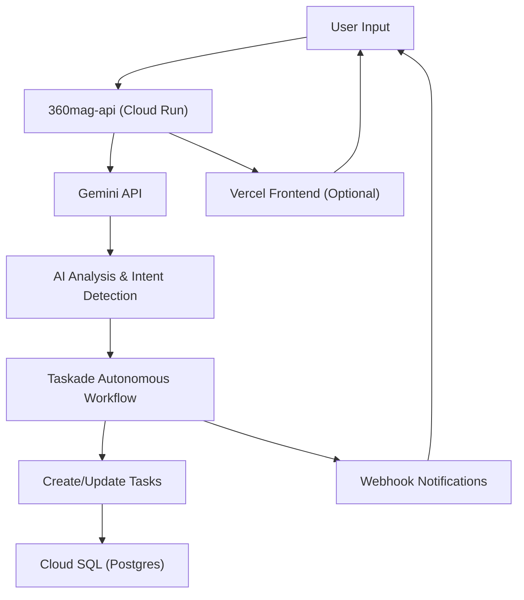

### 360magicians — GCP Alternative Deployment

Autonomous deployment configuration for **360magicians** using Google Cloud Platform (GCP) with optional Vercel frontend and Taskade integration.

### Architecture Overview

- **Backend:** GCP Cloud Run (containerized services)
- **Frontend:** Vercel (Next.js/React) — optional, evaluate vs GCP hosting
- **Database:** GCP Cloud SQL (Postgres) or Supabase
- **AI:** Google Gemini API integration
- **Orchestration:** Taskade API for autonomous workflow management

### GCP Services Required

- `Cloud Run` - Container hosting for backend services
- `Cloud SQL (Postgres)` - Managed database
- `Cloud Storage` - File and asset storage
- `Secret Manager` - Secure credential storage
- `Cloud Build` - CI/CD pipeline
- `Gemini API` - AI/ML integration via Vertex AI or direct API

### [deploy-360mag-gcp.sh](http://deploy-360mag-gcp.sh)

```bash
#!/bin/bash
# deploy-360mag-gcp.sh
# GCP deployment runner for 360magicians (autonomous system)

set -e

# === CONFIGURATION ===
PROJECT_ID="360magicians-prod"
REGION="us-central1"
SERVICE_NAME="360mag-api"
CLOUD_SQL_INSTANCE="360mag-postgres"
GEMINI_API_KEY="[from GCP Console]"
TASKADE_API_KEY="[from Taskade]"
TASKADE_WORKSPACE_ID="[workspace-id]"

echo "🔐 Authenticating to GCP..."
gcloud auth login
gcloud config set project $PROJECT_ID

echo "🗄️ Creating Cloud SQL Postgres instance..."
gcloud sql instances create $CLOUD_SQL_INSTANCE \
    --database-version=POSTGRES_14 \
    --tier=db-f1-micro \
    --region=$REGION

gcloud sql databases create 360magicians \
    --instance=$CLOUD_SQL_INSTANCE

echo "🔑 Storing secrets in Secret Manager..."
echo -n "$GEMINI_API_KEY" | gcloud secrets create gemini-api-key --data-file=-
echo -n "$TASKADE_API_KEY" | gcloud secrets create taskade-api-key --data-file=-

echo "🚀 Deploying to Cloud Run..."
gcloud run deploy $SERVICE_NAME \
    --image gcr.io/$PROJECT_ID/360mag-api:latest \
    --region $REGION \
    --platform managed \
    --allow-unauthenticated \
    --set-env-vars "GEMINI_API_KEY=projects/$PROJECT_ID/secrets/gemini-api-key:latest" \
    --set-env-vars "TASKADE_API_KEY=projects/$PROJECT_ID/secrets/taskade-api-key:latest" \
    --set-env-vars "TASKADE_WORKSPACE_ID=$TASKADE_WORKSPACE_ID" \
    --set-cloudsql-instances $PROJECT_ID:$REGION:$CLOUD_SQL_INSTANCE

echo "✅ 360magicians deployed on GCP!"
echo "🌐 Service URL: $(gcloud run services describe $SERVICE_NAME --region $REGION --format 'value(status.url)')"

```

### Gemini API Integration

Autonomous AI features powered by Google Gemini:

- **Content generation** - Dynamic content creation via Gemini API
- **Task automation** - AI-driven workflow orchestration with Taskade
- **Natural language processing** - Intent detection and command parsing
- **Image analysis** - Gemini Vision for visual content processing

### Taskade Integration (Autonomous System)

Linking 360magicians with Taskade for autonomous workflow management:

```jsx
// Taskade API integration example
const TASKADE_API = 'https://www.taskade.com/api/v1';
const WORKSPACE_ID = process.env.TASKADE_WORKSPACE_ID;
const API_KEY = process.env.TASKADE_API_KEY;

async function createAutonomousTask(projectId, taskData) {
  const response = await fetch(
    `${TASKADE_API}/workspaces/${WORKSPACE_ID}/projects/${projectId}/tasks`,
    {
      method: 'POST',
      headers: {
        'Authorization': `Bearer ${API_KEY}`,
        'Content-Type': 'application/json'
      },
      body: JSON.stringify(taskData)
    }
  );
  return response.json();
}

// Autonomous workflow triggered by Gemini AI analysis
async function autonomousWorkflow(userInput) {
  const geminiResponse = await analyzeWithGemini(userInput);
  const taskStructure = geminiResponse.suggestedTasks;
  
  for (const task of taskStructure) {
    await createAutonomousTask(PROJECT_ID, task);
  }
}

```

### Frontend Decision: Vercel vs GCP

| **Option** | **Pros** | **Cons** |
| --- | --- | --- |
| Vercel | ·Optimized for Next.js·Automatic edge deployment·Built-in CI/CD·Great DX | ·Additional vendor·Separate billing·External dependency |
| GCP (Cloud Run / Firebase Hosting) | ·Single cloud provider·Unified billing·Better integration with backend·Secret Manager access | ·More manual setup·Less optimized for Next.js·Requires more config |

**Recommendation:** Start with Vercel for rapid frontend deployment, evaluate migration to GCP after validating product-market fit.

### Data Flow (360magicians Autonomous System)



### Environment Variables (GCP Secret Manager)

- `gemini-api-key` - Google Gemini API key for AI features
- `taskade-api-key` - Taskade API key for autonomous workflows
- `taskade-workspace-id` - Taskade workspace identifier
- `db-connection-string` - Cloud SQL Postgres connection
- `vercel-deploy-hook` - Optional webhook for frontend updates

### Autonomous System Features

- **AI-driven task creation** - Gemini analyzes user input and auto-creates structured Taskade tasks
- **Smart prioritization** - ML-based task ranking and scheduling
- **Automatic workflow progression** - Tasks move through stages based on completion triggers
- **Context-aware suggestions** - Gemini provides next-action recommendations
- **Natural language commands** - Users interact via conversational interface

### Next Steps

- [ ]  Set up GCP project and enable required APIs
- [ ]  Obtain Gemini API key from Google AI Studio or Vertex AI
- [ ]  Configure Taskade API access and workspace ID
- [ ]  Build and push container image to GCR
- [ ]  Run `deploy-360mag-gcp.sh`
- [ ]  Decide on Vercel vs GCP for frontend hosting
- [ ]  Test autonomous workflow: input → Gemini → Taskade → confirmation
